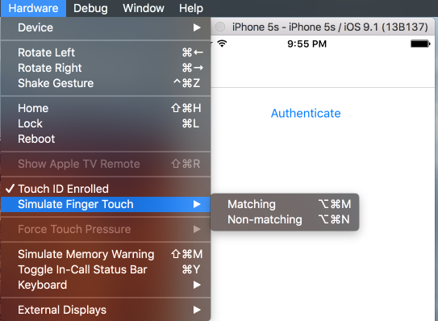

# Maui.Biometric

[](https://www.nuget.org/packages/Oscore.Maui.Biometric/)
[](https://github.com/oscoreio/Maui.Biometric/actions/workflows/dotnet.yml)
[](https://github.com/oscoreio/Maui.Biometric/blob/main/LICENSE)

Provides a cross-platform implementation of biometric authentication.  
Supports iOS, macOS, Android and Windows.  
This repository has been rewritten taking into account the API of the xamarin-fingerprint and Plugin.Maui.Biometric libraries

### Supported Platforms
| Platform | Minimum Version Supported             |
|----------|---------------------------------------|
| iOS      | 12.2+                                 |
| macOS    | 15+                                   |
| Android  | 5.0 (API 21)                          |
| Windows  | 11 and 10 version 1809+ (build 17763) |

## Usage
- Add NuGet package to your project:
```xml
<PackageReference Include="Oscore.Maui.Biometric" Version="2.0.0" />
```

- iOS - Add `NSFaceIDUsageDescription` to your Info.plist to describe the reason your app uses Face ID. 
(see [Documentation](https://developer.apple.com/library/content/documentation/General/Reference/InfoPlistKeyReference/Articles/CocoaKeys.html#//apple_ref/doc/uid/TP40009251-SW75)). 
Otherwise the App will crash when you start a Face ID authentication on iOS 11.3+.
```xml
	<key>NSFaceIDUsageDescription</key>
	<string>This app requires Face ID for secure authentication and to provide a personalized experience.</string>
```

- Android - Request the permission in `AndroidManifest.xml`
```xml
<uses-permission android:name="android.permission.USE_FINGERPRINT" android:maxSdkVersion="27" />
<uses-permission android:name="android.permission.USE_BIOMETRIC" android:minSdkVersion="28" />
```

- Add the following to your `MauiProgram.cs` `CreateMauiApp` method:
```diff
builder
    .UseMauiApp<App>()
+   .UseBiometricAuthentication()
    .ConfigureFonts(fonts =>
    {
        fonts.AddFont("OpenSans-Regular.ttf", "OpenSansRegular");
        fonts.AddFont("OpenSans-Sed:nammibold.ttf", "OpenSansSemibold");
    });
```

- Use through `BiometricAuthentication.Current` or using `IBiometricAuthentication` from DI:
```csharp
// You don't need to check if the device supports biometric authentication, the plugin does it for you
var result = await BiometricAuthentication.Current.AuthenticateAsync(
    new AuthenticationRequest(
        title: "Authenticate",
        reason: "Please authenticate to proceed"));
if (result.IsSuccessful)
{
    // User authenticated
}
```

## Testing on Simulators

### iOS



With the Hardware menu you can

- Toggle the enrollment status
- Trigger valid (<kbd>⌘</kbd> <kbd>⌥</kbd> <kbd>M</kbd>) and invalid (<kbd>⌘</kbd> <kbd>⌥</kbd> <kbd>N</kbd>) fingerprint sensor events

### Android

- start the emulator (Android >= 6.0)
- open the settings
- go to Security > Fingerprint, then follow the enrollment instructions
- when it asks for touch
- open the Emulator Settings
- go to Fingerprint menu

## Links
- https://github.com/smstuebe/xamarin-fingerprint
- https://github.com/FreakyAli/Plugin.Maui.Biometric